<p align="center">
  
</p>

<h1 align="center">⚡ ElimuMS</h1>
<h3 align="center">Kenya's Most Complete CBC School Management System</h3>

<p align="center">
  One platform. Every school need. Built for Kenyan schools. Powered by AI.
</p>

<p align="center">
  
  
  
  
  
  
  
  
  
</p>

---

## 🎯 What is ElimuMS?

**ElimuMS** is a fully open-source, self-hosted, enterprise-grade school management system built from the ground up for Kenyan schools implementing the **Competency-Based Curriculum (CBC)**. It unifies every aspect of school operations — academics, finance, transport, communication, AI assistance, and parent engagement — into one powerful, beautifully designed platform.

> **Own your data. Deploy on your server. Pay once. Run forever.**

ElimuMS is not a SaaS subscription. It is yours — fully open-source, self-hosted, and infinitely customisable for your school's unique needs.

---

## 🏫 Supported School Levels

| Level | Grades | Status |
|---|---|:---:|
| Pre-Primary | PP1 – PP2 | ✅ Fully Supported |
| Lower Primary | Grade 1 – 3 | ✅ Fully Supported |
| Upper Primary | Grade 4 – 6 | ✅ Fully Supported |
| Junior Secondary | Grade 7 – 9 | ✅ Fully Supported |
| Senior Secondary | Grade 10 – 12 | ✅ Fully Supported |
| Multi-campus / County Rollout | — | 🔧 Roadmap |

---

## 👥 Demo Environment

The system ships with a complete, realistic demo dataset:

| User Type | Count | Details |
|---|:---:|---|
| 👩‍🏫 Teachers | 10 | Assigned to learning areas & classes |
| 👨‍👩‍👧 Parents / Guardians | 20 | Linked to learners (including sibling pairs) |
| 🧒 Learners | 40 | Spread across PP1 → Grade 9 |
| 🏫 HODs | 2 | English & Mathematics departments |
| 🎓 Class Teachers | 5 | One per stream |

Run `php artisan migrate --seed` to load demo data. See **INSTALL.md** for full configuration.

---

## 🚀 Feature Modules

### 🏛️ 1. School Management — Core

The operational backbone of the entire system.

- Learner registration & enrollment (PP1 → Grade 12)
- KEMIS UPI number assignment, sync & validation
- Class and stream assignment per term and academic year
- Transfer-in / transfer-out with full audit trail
- Boarding vs day scholar tracking with different fee structures
- Special educational needs (SEN) recording per learner
- Sibling linking for family-level fee discounts
- Disciplinary records and follow-up tracking
- Alumni registry

---

### 📋 2. CBC Assessment Engine

The most comprehensive CBC assessment tool built for Kenyan teachers.

- Full **EE / ME / AE / BE** rubric entry per strand and sub-strand
- 40% formative + 60% summative weighting — automatically calculated
- Bulk assessment import via Excel — entire class in minutes
- Competency portfolio per learner — tracks growth from PP1 to Grade 12
- Grade 7–12 numeric marks alongside rubric levels
- Missed assessment alerts — flags incomplete assessment records
- HOD approval workflow for submitted assessments
- Term-level competency locking for audit integrity

---

### 📊 3. Analytics, Insights & Reporting

Data-driven decisions for principals, HODs, and teachers.

- Live school performance dashboard with real-time charts
- Per-class, per-stream, per-teacher comparison analytics
- **Strand heatmaps** — identify exactly which sub-strands learners struggle with most across the school
- **At-risk learner detection** — rolling averages flag learners before they fall behind
- **Early alert system** — auto-notifies class teacher when a learner drops below configured threshold
- **Cohort tracking** — follow a class from enrollment all the way to Grade 12
- Term-on-term competency trend graphs
- Rubric distribution charts (EE/ME/AE/BE breakdown per class and school-wide)
- Teacher performance metrics — assessment completion rates, average rubric levels awarded
- HOD department analytics — compare teachers within a learning area
- Principal & BOG ready summary reports (PDF)
- KEMIS-ready data exports

---

### 📄 4. CBC Report Cards

Automated, professional, CBC-compliant report cards.

- Auto-generated PDF report cards in full EE/ME/AE/BE format per strand
- Competency descriptors auto-populated per learning area
- AI-assisted teacher & principal remarks (see AI Tools)
- Attendance summary embedded in every report card
- Cumulative multi-term report generation
- **Digital delivery to parents via SMS link** — no printing required
- Bulk generation — produce an entire class's reports in one click
- Customisable school branding (logo, colours, motto)

---

### 🤖 5. AI Tools — Powered by Anthropic Claude

The most advanced AI toolkit ever built into a Kenyan school system.

| AI Tool | What It Does |
|---|---|
| 🧠 **AI Lesson Assistant** | Generates complete lesson plans from strand, sub-strand & SLOs in seconds |
| ✅ **AI Marking Assistant** | Teacher submits learner response; AI suggests rubric level with written justification |
| 📝 **AI Question Generator** | Upload notes or a topic; get a ready CAT or exam with MCQ, short-answer & essay |
| 📈 **AI Performance Insights** | Reviews a learner's full competency history and flags root causes of underperformance |
| 💬 **AI Report Comments** | Auto-suggests teacher remarks appropriate to each rubric level per learning area |
| 🗓️ **AI Timetable Optimizer** *(roadmap)* | Learns teacher preferences & room availability; auto-generates conflict-free schedules |

All AI features are powered by the **Anthropic Claude API** — the most capable AI model available.

---

### 🧩 5b. AI Tools — Extended (Classes & Notes)

| AI Tool | What It Does |
|---|---|
| 🧮 **AI Class Balancer** | Analyses last term's assessment data and suggests stream splits that avoid clustering struggling learners in one stream |
| 🔁 **AI Substitute Finder** | Cross-references `STAFF_LEARNING_AREAS` and leave records to suggest the best-fit substitute teacher automatically |
| 📋 **AI Class Handover Brief** | Generates a one-page brief (competency spread, at-risk learners, recent notes) for a teacher newly assigned to a class |
| 👥 **AI Grouping Suggestions** | Suggests learner groupings for group work based on complementary rubric levels per sub-strand |
| 📝 **AI Notes Summarizer** | Condenses uploaded notes/slides into a learner-friendly one-pager with key terms |
| ❓ **AI Notes-to-Quiz** | Auto-generates a short quiz from uploaded notes, tagged to the relevant strand/sub-strand |
| 🔍 **AI Notes Gap Finder** | Scans uploaded notes against CBC specific learning outcomes (SLOs) and flags sub-strands with no notes yet |
| 🎯 **AI Simplify / Differentiate** | Generates a simplified version of notes for learners below the expected competency level for a sub-strand |
| 🌍 **AI Translation Assist** | Translates notes to/from Kiswahili for lower primary mother-tongue instruction |

---

### 📚 6. Smart Homework System

A complete digital homework workflow from assignment to grading.

- Teacher assigns homework per class and learning area with strand tagging
- Learners submit from phone or PC via the submission portal
- Deadline countdown display for learners and parents
- Auto-reminders via SMS + push — 24 hours and 1 hour before deadline
- Teacher marks submissions with rubric-aligned grading and written feedback
- **Parent visibility dashboard** — real-time homework status per child
- Homework analytics — class completion rates, average scores per assignment
- Late submission tracking with configurable grace periods

---

### 🚌 7. Transport & Bus Tracking

End-to-end school transport management with live GPS.

- Route management with stop mapping (latitude/longitude)
- Real-time bus location via GPS device integration
- Parent live tracking from the parent portal
- Driver alerts — route deviation, late arrival notifications
- Monthly transport fee auto-billing per route
- Incident reporting for drivers
- Vehicle register with maintenance scheduling
- Dedicated **`driver` role** — restricted to assigned route, vehicle status, and incident reporting only

---

### 🏠 8. Parent Engagement Portal

Keeping parents informed and connected, every day.

- Child academic dashboard — live rubric levels, attendance & upcoming homework
- Home learning resource library — curated by teachers per grade and learning area
- Parent-teacher messaging (threaded per child)
- School communication hub — notices, circulars, events & calendar
- Fee statement view and M-Pesa payment from portal
- Parent meeting scheduling with RSVP tracking
- Transport live tracking access

---

### 💰 9. Fees & Finance Management

A complete bursar system with M-Pesa at its core.

- Flexible fee structures per grade, term, boarding/day status, with sibling discounts
- **M-Pesa STK Push** — parents receive a payment prompt directly on their phone (Safaricom Daraja API)
- **C2B Paybill integration** — real-time payment confirmation and auto-allocation
- Fee balance and arrears tracking per learner
- Bursary and scholarship management with funding source records
- PDF receipts auto-sent to parent on every payment
- Automated SMS fee reminders — 7 days, 3 days, and on due date (configurable)
- Finance analytics — daily/weekly/monthly collection reports
- Term revenue projections vs actual collection
- Expense tracking and simple income statement for bursar
- Outstanding arrears report for follow-up

---

### 📦 10. Inventory & Store Management

Full asset and stock control for the school storekeeper.

- School assets register with condition and depreciation tracking
- CBC textbook inventory — issue and return per learner with signature record
- Lab equipment register
- Stationery store with quantity tracking
- Low-stock alerts — auto-notifies storekeeper
- Procurement module — raise LPOs, track deliveries, mark received
- Supplier register with contact management

---

### 📝 11. Exams Management

From setting to results — fully managed.

- Create CATs, mid-terms, end-terms, mocks, KPSEA, KCSE papers
- Question bank with MCQ, short answer, and structured essay types
- Tag questions by strand, sub-strand, and Bloom's taxonomy level
- Exam timetable with invigilation schedule and room assignment
- Mark entry with auto-calculation of grade, percentage, and rubric level
- KPSEA (Grade 6) and KCSE alignment templates
- Per-subject, per-class, and per-stream exam analytics
- Past paper archive by subject and year

---

### 📓 12. Learning Notes & Digital Library

A searchable digital library accessible to teachers, learners, and parents.

- Teacher uploads notes — PDF, video, images, slides
- Organised by grade, learning area, strand, sub-strand
- Learner portal — searchable and filterable resource library
- Parent portal access for home learning support
- Offline-friendly downloadable packs (PWA — roadmap)
- Resource analytics — most-viewed notes, download counts

---

### 🔔 13. Notifications & Communication

Multi-channel communication across every stakeholder.

- **SMS** via Africa's Talking API — bulk and triggered
- **Email** via Mailgun / SMTP
- **Push notifications** via Firebase Cloud Messaging
- **WhatsApp** *(roadmap)*
- Bulk SMS by grade, class, boarding status, or custom group
- Automated alerts: fees due, results ready, absenteeism, homework overdue
- Scheduled announcements — set a message to go out at a future time
- Delivery reports — track which messages were delivered

---

### ⏰ 14. Timetable Scheduler

Intelligent, conflict-free scheduling.

- Auto-generate timetables per class
- Teacher and room assignment with availability checking
- Double-period and afternoon session support
- Conflict detection with automated substitute teacher suggestions
- Printable timetable per class and per teacher
- AI Optimizer *(roadmap)* — learns preferences and auto-generates the optimal schedule

---

### 👩‍🏫 15. Staff & HR Management

Complete HR for teaching and non-teaching staff.

- Teacher profiles with TSC number, qualifications, and subjects assigned
- Leave management — annual, sick, maternity, paternity, compassionate
- Leave approval workflow: Teacher → HOD → Deputy Principal → Principal
- Payroll summary with PAYE, NHIF, NSSF, NITA deduction calculations
- Professional development records — trainings attended, certifications earned
- Staff performance metrics — punctuality, assessment completion rates, lesson plan submissions

---

### 📈 16. Attendance Management

Accurate, automated attendance with instant parent alerts.

- Daily class attendance — present, absent, late, excused
- Teacher attendance (principal and deputy principal view)
- **Automated SMS to parent** when learner is marked absent
- Monthly attendance reports per learner
- Chronic absenteeism alerts — flags learners missing a threshold of days
- Attendance integrated into report cards — auto-populated on generation
- Stream-level and school-wide attendance analytics

---

### 📊 17b. TPAD (Teacher Performance Appraisal and Development)

TSC-compliant teacher appraisal, term by term.

- Term target-setting per teacher, aligned to TSC's TPAD tool
- Lesson observation scoring by HOD / Deputy Principal / Principal
- Self-appraisal submission by teacher
- HOD sign-off workflow feeding into `PROFESSIONAL_DEVELOPMENT` records
- TPAD score history per teacher, exportable for TSC returns
- Links directly to Staff & HR performance metrics already in the system

---

### 🎯 17c. Senior School Pathway Selection

Guides the Grade 9 → Grade 10 transition using real competency data.

- Pathway recommendation engine (STEM / Social Sciences / Arts & Sports) built from a learner's Grade 7–9 `ASSESSMENTS` history
- Parent/guardian review and sign-off on the recommended pathway
- Career interest questionnaire to complement competency data
- HOD/Deputy Principal override with justification note
- Cohort-level pathway distribution reporting for capacity planning

---

### 🪪 17d. Digital Learner ID & QR

One QR-coded ID card that ties attendance, library, transport, and (planned) security together.

- QR-coded learner ID auto-generated on enrollment
- Gate tap-in/tap-out feeding `ATTENDANCE_RECORDS` (once `security` role/module is live)
- Library checkout via QR scan feeding `INVENTORY_ISSUES`
- Bus boarding/alighting via QR scan feeding `TRANSPORT_ENROLLMENTS`
- Exam room identity verification
- Printable ID card template with school branding

---

### 🏛️ 17e. PTA / BOG Governance Portal

Meets Kenya's legal requirement for documented Board of Governors and PTA proceedings.

- Meeting scheduling with agenda upload
- Digital minutes recording and resolution tracking
- Budget approval sign-off, linked to the `EXPENSES` table
- Termly report acknowledgment by BOG members
- Document archive for compliance/audit purposes

---

### 🚩 17f. AI Fee Defaulter Risk Scoring

Proactive, not reactive, arrears management.

- Risk score per learner based on `INVOICES`/`PAYMENTS` payment pattern history, not just current balance
- Early-warning list surfaced to the bursar before a term's arrears pile up
- Suggested intervention (payment plan, bursary referral) per risk band
- Trend view — school-wide defaulter risk by term

---

### 📴 17g. Offline-First Sync

Built for low-connectivity areas like rural Machakos/Mwala, not just an installable PWA.

- Attendance and assessment entry work fully offline on a teacher's phone
- Local queue syncs automatically once connectivity returns
- Conflict resolution rules for records edited both offline and online
- Sync status indicator per device so teachers know what's pending

---

### 🎓 17h. NG-CDF / CDF Bursary Application Tracker

Turns manual county bursary nominal-roll work into a built-in workflow.

- Learner bursary application intake — ULI, KNEC/KCPE number, validation status
- Auto-generates county-committee export format from `LEARNERS` + `INVOICES` data
- Application status tracking — applied, submitted, approved, disbursed
- Eligible-but-not-applied flagging, cross-referenced against fee arrears
- Nominal roll versioning per funding cycle (NG-CDF, county bursary, private sponsor)

---

### 👪 17i. Multi-Guardian Custody & Access Rules

Reflects real Kenyan family/guardianship structures instead of a single parent record.

- `role_on_learner` field on `PARENT_LEARNER` — financial, academic, emergency-contact-only, full access
- Multiple guardians per learner with independently scoped portal permissions
- Sponsor (NGO/CDF/relative) access limited to fee and attendance visibility only
- Audit trail of who viewed or acted on a learner's record and under what scope

---

### 🍽️ 17j. School Feeding Programme Tracking

For schools on the Home Grown School Meals Programme.

- Daily meal attendance capture per learner, linked to `ATTENDANCE_SESSIONS`
- Supplier delivery log with quantity and quality checks
- Nutrition compliance checklist per term
- Feeding cost tracking against allocated programme funds

---

### 🏅 17k. Co-curricular Talent Pipeline

Tracks a learner's progression through Kenya's festival structure — a core CBC talent-development requirement most systems ignore.

- Talent area registration (music, ball games, drama, athletics) per learner
- Progression tracking: Zone → Sub-County → County → National
- Achievement records feed directly into the learner's competency portfolio
- Coach/patron assignment and participation reporting per festival cycle

---

### 📵 17l. SMS/USSD Fallback for Feature-Phone Parents

Extends reach beyond the smartphone-only parent portal — often the real adoption blocker, not missing features.

- USSD menu (`*XXX#`) for fee balance check
- SMS opt-in for attendance alerts and report-card notifications
- Works on any phone, no app or internet required
- Same backend as the parent portal — no duplicate data entry

---

### 🔁 17m. Automated NEMIS/KEMIS Discrepancy Reconciliation

Catches mismatches before they cause a rejected bursary or exam registration.

- Scheduled job diffs ElimuMS learner records against the last KEMIS export
- Flags name spelling, grade, and status mismatches automatically
- Reconciliation queue for admin review and correction
- Pre-submission validation reused from existing KEMIS Integration module

---

### 🌐 17. KEMIS Integration

Fully aligned with government reporting requirements.

- Learner UPI registration and bulk sync to KEMIS
- School data export formatted for MOEST reporting
- KPSEA candidate registration support
- Pre-submission validation — catches missing UPIs and duplicates before export

---

### 💻 18. Online Classes

Live and recorded lessons for remote or blended learning, tied directly into the class and curriculum structure.

- Schedule live sessions per stream, learning area, and sub-strand — appears on the learner/parent timetable automatically
- Video provider integration — Google Meet / Zoom / Jitsi (configurable per school)
- One-click join links generated per session, sent via SMS + push + in-portal
- Auto-recording — session recording link attached to the session and pushed to the Notes library on completion
- Online attendance capture — join/leave timestamps feed into the same `ATTENDANCE_RECORDS` used for in-person classes, tagged `mode: online`
- Teacher can attach notes, homework, or a quiz directly to a session
- Parent visibility — parents see upcoming and past sessions for each child, with recording access
- Low-bandwidth fallback — audio-only join option and downloadable session summary for poor-connectivity areas
- Session analytics — attendance rate, average watch time on recordings, per-stream comparison

---

## 🔐 Roles & Access Control

Twelve roles with granular permission control powered by **Spatie Laravel Permission**.

| Role | Access Scope |
|---|---|
| `super-admin` | Full system access, multi-school management |
| `principal` | School-wide management and all reports |
| `deputy-principal` | Academics, discipline, leave approvals |
| `hod` | Department oversight, lesson plan approval, dept analytics |
| `class-teacher` | Class management, assessment entry, attendance marking |
| `teacher` | Assessment entry, notes upload, homework assignment |
| `bursar` | Fees, payments, finance reports, inventory |
| `librarian` | Library and learning resource management |
| `storekeeper` | Inventory management and procurement |
| `driver` | Assigned route and vehicle status, incident reporting |
| `parent` | Child progress, fees, notes, messaging, transport tracking |
| `learner` | Notes, timetable, homework submission, results |

> 🔧 **Planned roles** (pending supporting modules): `nurse` (health records), `security` (gate log / visitor management), and `board-member` (PTA/BOG governance portal — meetings, minutes, budget sign-off). See Roadmap.

---

## 🗄️ Database Schema & Entity Relationships

> All diagrams use **Mermaid ERD** syntax. Render on GitHub, Notion, or any Mermaid-compatible viewer.

---

### 1. Users & People

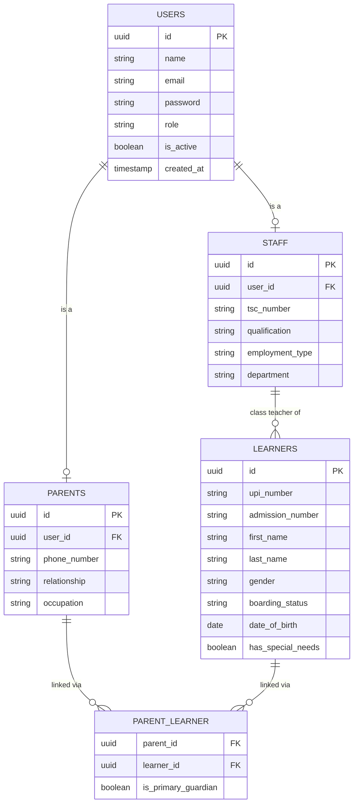

---

### 2. Academic Structure

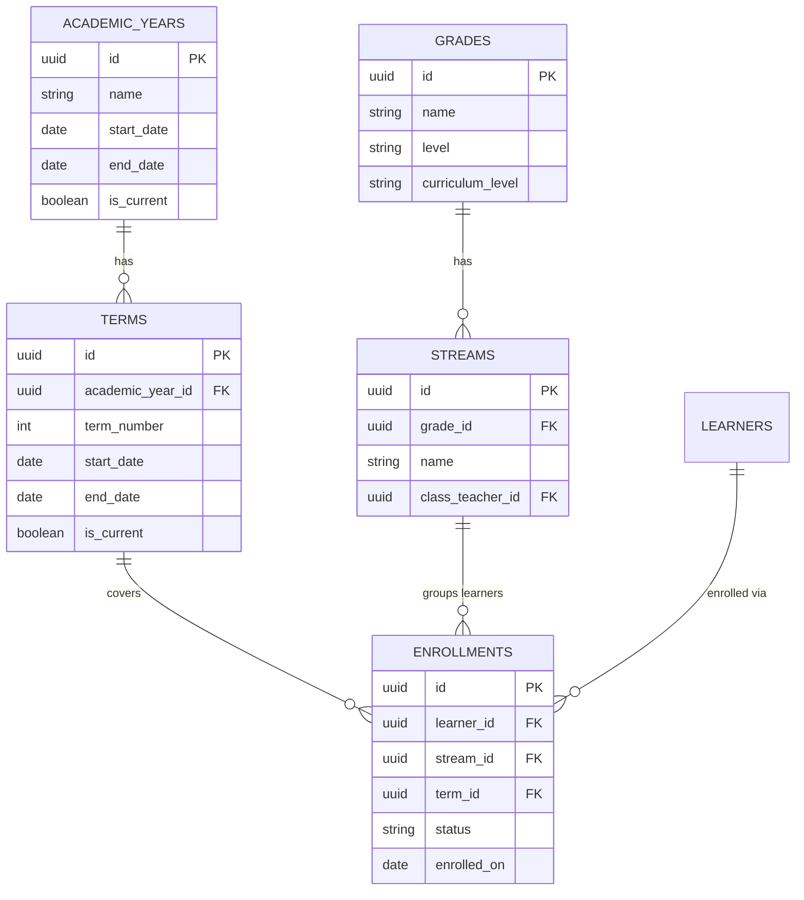

---

### 3. CBC Assessment Engine

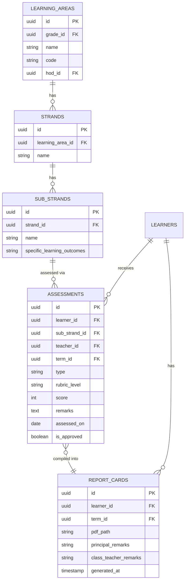

---

### 4. Fees & Finance

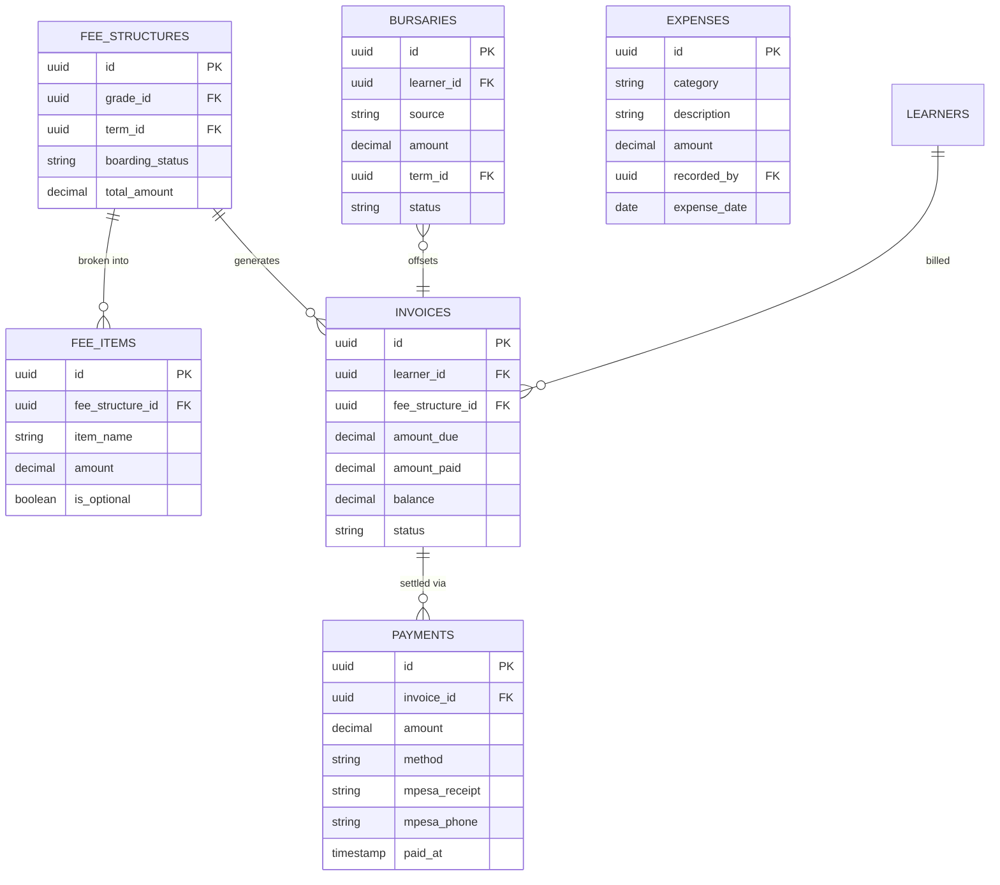

---

### 5. Homework & Submissions

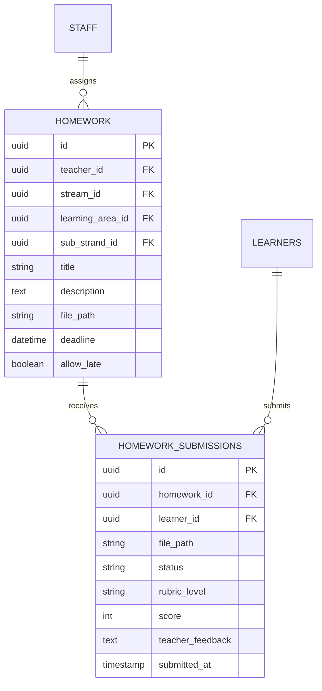

---

### 6. Attendance

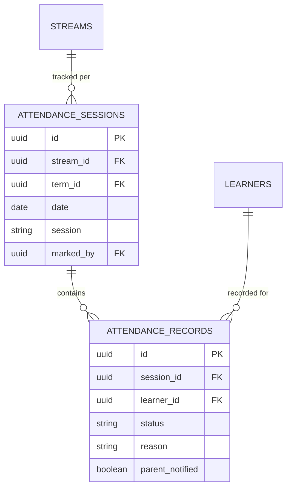

---

### 7. Transport

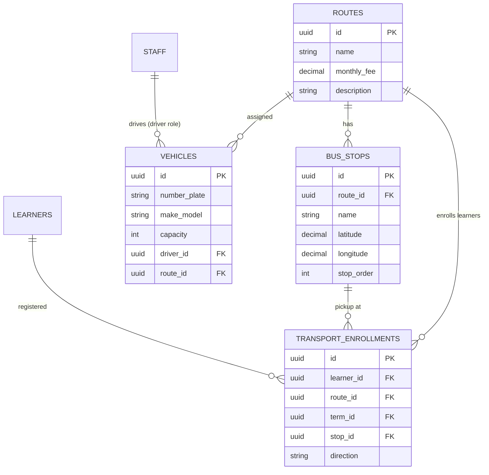

---

### 8. Inventory & Store

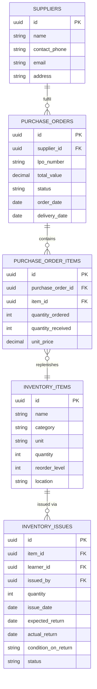

---

### 9a. TPAD

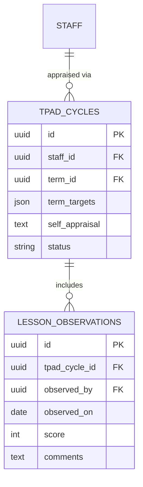

---

### 9b. Pathway Selection

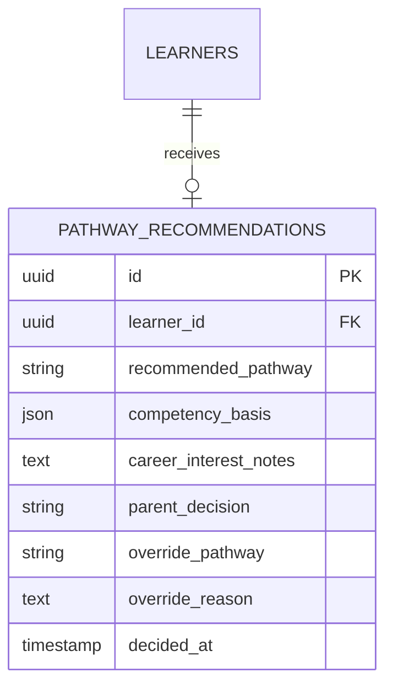

---

### 9c. Governance (PTA/BOG)

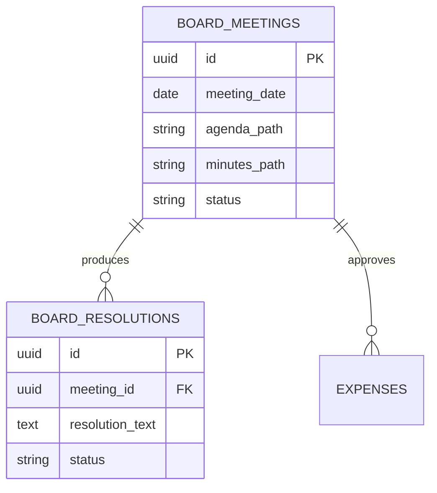

---

### 9d. Online Classes

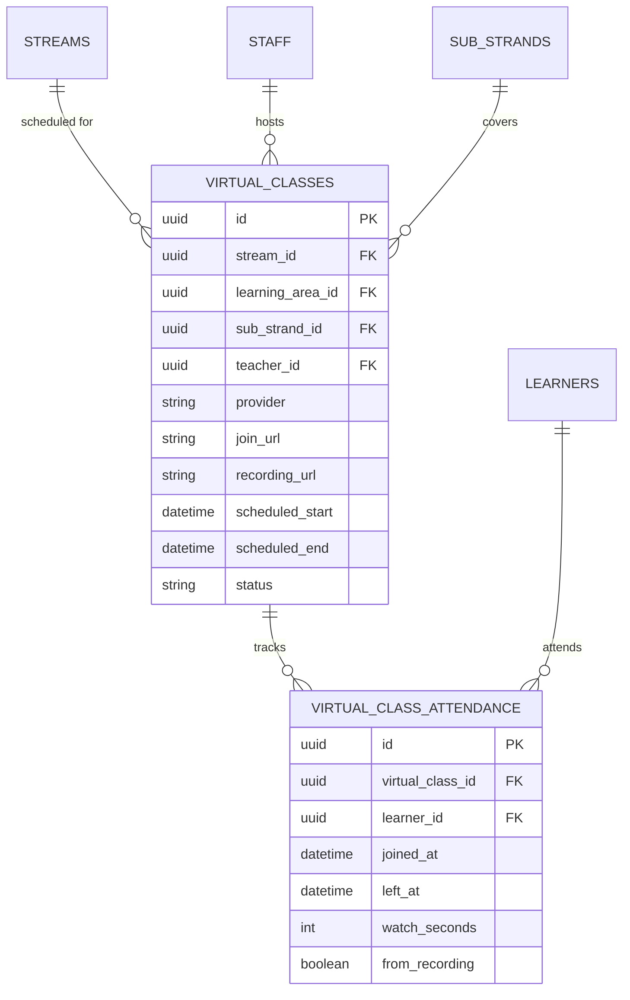

---

### 9e. Bursary Tracker

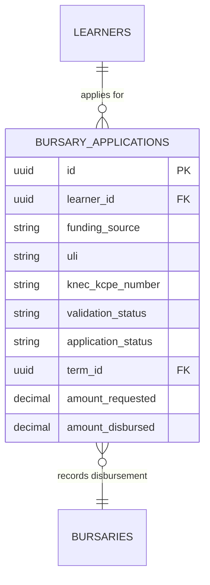

---

### 9f. Feeding Programme

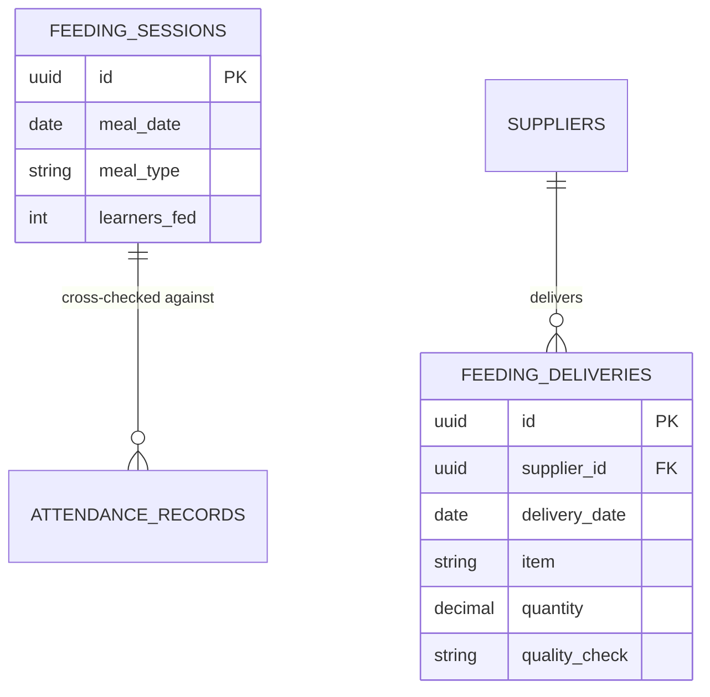

---

### 9g. Talent Pipeline

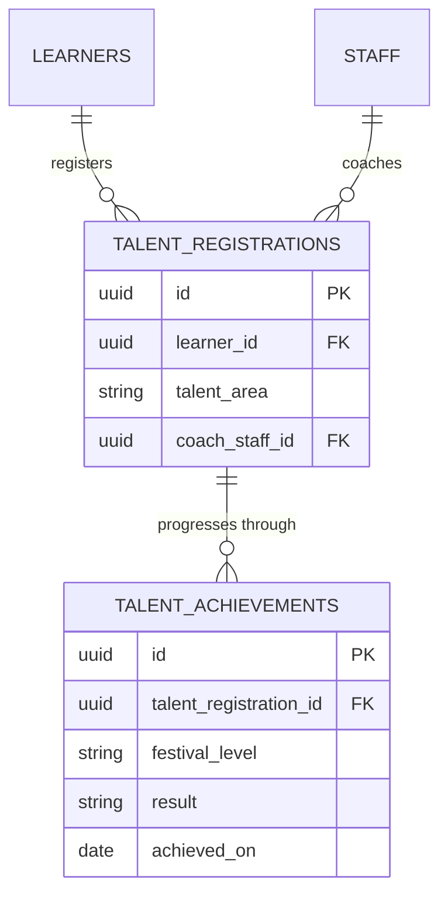

---

### 10. Staff & HR

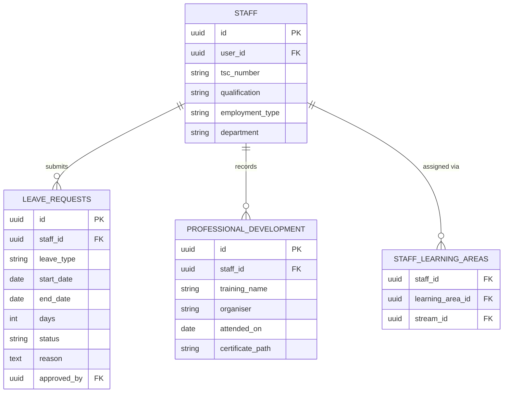

---

## 🛠️ Tech Stack

| Layer | Technology |
|---|---|
| Backend Framework | Laravel 12 |
| Reactive Frontend | Livewire 3 + Alpine.js |
| UI Framework | Tailwind CSS |
| Roles & Permissions | Spatie Laravel Permission |
| PDF Generation | DomPDF |
| SMS Gateway | Africa's Talking API |
| Payment Gateway | Safaricom Daraja (M-Pesa STK Push + C2B) |
| Push Notifications | Firebase Cloud Messaging (FCM) |
| AI Engine | Anthropic Claude API |
| Video Conferencing | Google Meet / Zoom / Jitsi (configurable) |
| Database | MySQL 8.0 |
| Queue & Cache | Redis (production) / File driver (XAMPP / local) |
| File Storage | Laravel Storage — local / S3 (roadmap) |
| Email | Mailgun / SMTP |

---

## ⚡ Quick Start

```bash
# 1. Clone the repository
git clone https://github.com/Dantechdevs/elimums.git
cd elimums

# 2. Install PHP dependencies
composer install

# 3. Set up environment
cp .env.example .env
php artisan key:generate

# 4. Configure your database in .env
# DB_DATABASE=elimums
# DB_USERNAME=root
# DB_PASSWORD=

# 5. Create the database
# In phpMyAdmin or MySQL CLI: CREATE DATABASE elimums;

# 6. Run migrations and seed demo data
php artisan migrate --seed

# 7. Build frontend assets
npm install && npm run build

# 8. Link storage
php artisan storage:link

# 9. Start the development server
php artisan serve
```

Visit **http://localhost:8000**

---

## 🔑 Default Login Accounts

| Role | Email | Password |
|---|---|---|
| Super Admin | admin@school.ac.ke | Admin@1234 |
| Principal | principal@school.ac.ke | Principal@1234 |
| Bursar | bursar@school.ac.ke | Bursar@1234 |
| HOD (English) | hod.english@school.ac.ke | Hod@1234 |
| HOD (Mathematics) | hod.maths@school.ac.ke | Hod@1234 |
| Class Teacher | classteacher@school.ac.ke | Teacher@1234 |
| Parent | parent@school.ac.ke | Parent@1234 |
| Learner | learner@school.ac.ke | Learner@1234 |

> ⚠️ **Important:** Change all default passwords immediately after first login in a production environment.

Full configuration guide — XAMPP virtual host, M-Pesa sandbox, Africa's Talking sandbox, and Firebase setup — is in **INSTALL.md**.

---

## 🗺️ Roadmap

### ✅ Completed
- Core school management (learners, staff, grades, streams)
- Full CBC assessment engine (EE/ME/AE/BE — strand & sub-strand)
- M-Pesa fee payments (Daraja STK Push + C2B Paybill)
- SMS & push notifications (Africa's Talking + Firebase FCM)
- Inventory & store management with procurement
- Learning notes & digital resource library
- PDF report cards & M-Pesa payment receipts
- KEMIS integration with validation
- Role-based access control (12 roles — Spatie, including `driver`)
- Role-based login redirect
- Attendance management with automated parent SMS alerts
- Staff HR — leave, professional development, payroll summary
- Demo dataset (40 learners, 10 teachers, 20 parents — PP1 to Grade 9)

### 🔧 In Progress
- Deep analytics dashboard (cohort tracking, heatmaps, at-risk alerts)
- AI Lesson Assistant (Claude API)
- AI Marking Assistant (Claude API)
- Smart homework submission & rubric grading system
- Online classes — scheduling, provider integration, online attendance capture

### 📅 Planned

See **[ROADMAP.md](ROADMAP.md)** for the full planned feature list, grouped by theme (AI Tools, Online Classes, CBC/Kenya-Specific, Access & Governance, Reach & Connectivity, Platforms).

---

## 🤝 Contributing

```bash
# Fork, create a branch, commit, push, open a PR
git checkout -b feat/your-feature
git commit -m "feat: describe your change"
git push origin feat/your-feature
```

| Commit Prefix | Use For |
|---|---|
| `feat:` | New feature |
| `fix:` | Bug fix |
| `chore:` | Config, dependencies, tooling |
| `docs:` | Documentation only |
| `refactor:` | Code restructure, no behaviour change |
| `test:` | Tests only |
| `migration:` | Database migration changes |

---

## 📜 License

**MIT License** — free to use, modify, and self-host. Attribution appreciated.

---

## 🙏 Acknowledgements

- [Kenya Ministry of Education](https://education.go.ke) — CBC curriculum framework
- [KEMIS](https://kemis.education.go.ke) — Kenya Education Management Information System
- [Safaricom Daraja](https://developer.safaricom.co.ke) — M-Pesa payment API
- [Africa's Talking](https://africastalking.com) — SMS gateway
- [Laravel](https://laravel.com) — The PHP framework for web artisans
- [Anthropic Claude](https://anthropic.com) — AI tools engine

---

<p align="center">
  <strong>ElimuMS — Built with ❤️ by <a href="https://ngwasidaniel.vercel.app/#contact">DanTech Developers</a></strong><br/>
  <em>"Smart Today. Success Tomorrow."</em>
</p>
